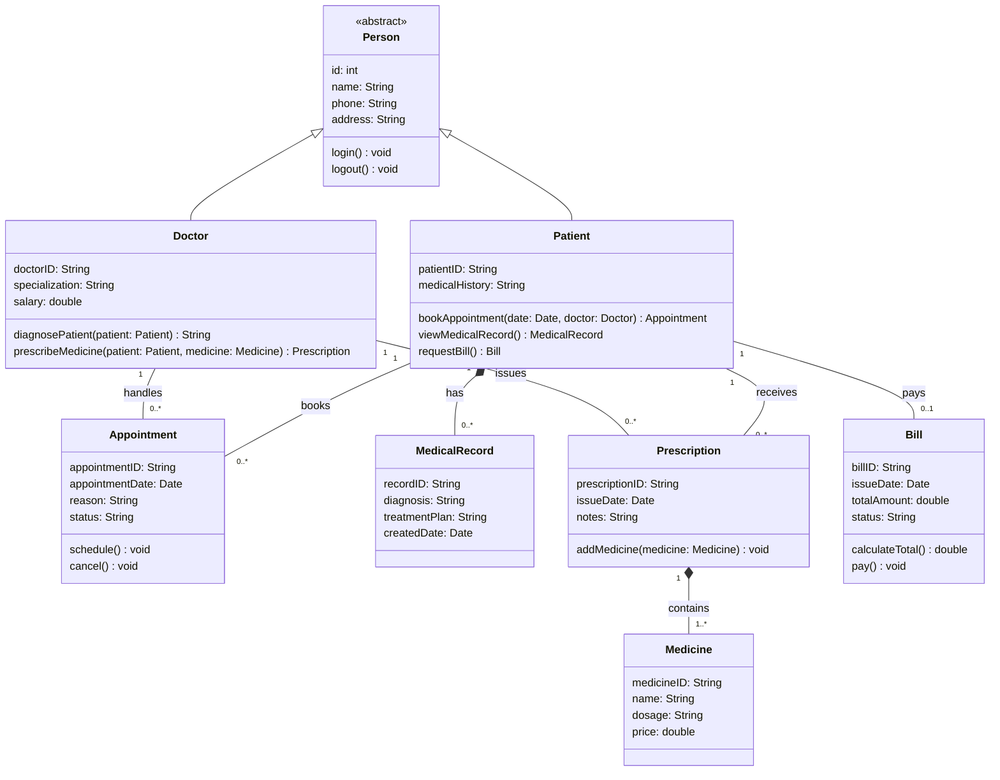

# Hospital UML Class Diagram

```mermaid
classDiagram
    class Person {
        <<abstract>>
        id: int
        name: String
        phone: String
        address: String
        login() void
        logout() void
    }
    class Patient {
        patientID: String
        medicalHistory: String
        bookAppointment(date: Date, doctor: Doctor) Appointment
        viewMedicalRecord() MedicalRecord
        requestBill() Bill
    }
    class Doctor {
        doctorID: String
        specialization: String
        salary: double
        diagnosePatient(patient: Patient) String
        prescribeMedicine(patient: Patient, medicine: Medicine) Prescription
    }
    class Appointment {
        appointmentID: String
        appointmentDate: Date
        reason: String
        status: String
        schedule() void
        cancel() void
    }
    class MedicalRecord {
        recordID: String
        diagnosis: String
        treatmentPlan: String
        createdDate: Date
    }
    class Prescription {
        prescriptionID: String
        issueDate: Date
        notes: String
        addMedicine(medicine: Medicine) void
    }
    class Medicine {
        medicineID: String
        name: String
        dosage: String
        price: double
    }
    class Bill {
        billID: String
        issueDate: Date
        totalAmount: double
        status: String
        calculateTotal() double
        pay() void
    }
    Person <|-- Patient
    Person <|-- Doctor
    Patient "1" -- "0..*" Appointment : books
    Doctor "1" -- "0..*" Appointment : handles
    Patient "1" *-- "0..*" MedicalRecord : has
    Patient "1" -- "0..*" Prescription : receives
    Doctor "1" -- "0..*" Prescription : issues
    Prescription "1" *-- "1..*" Medicine : contains
    Patient "1" -- "0..1" Bill : pays
```
